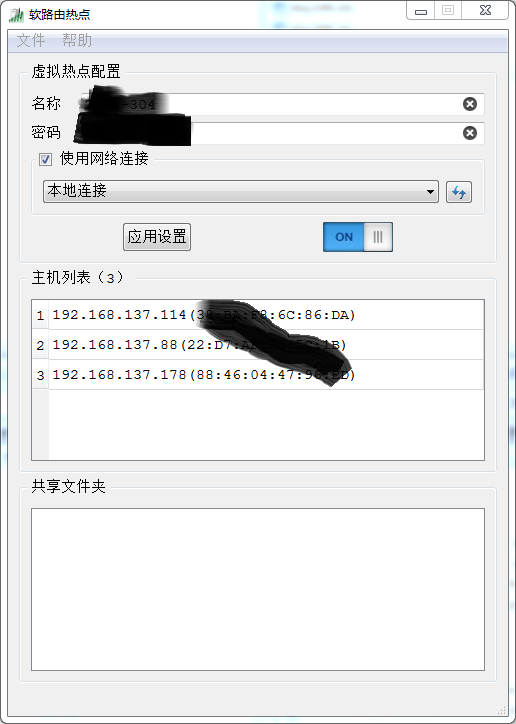

QSoftAP - A virtual WLAN utility for Windows 7 and above
========================================================

Main features
=============

- Virtual WLAN configuration
- Internet connection sharing
- Folder sharing management

Screenshot
==========

Using the release version
=========================

- Install the [VC++ 2015 runtime library](https://www.microsoft.com/en-US/download/details.aspx?id=48145)
- Download and unpack the compiled binaries from [Release.rar](./Release.rar), then **run the QSoftAP.exe as administrator**

Build from source
=================

- Compiler: MSVC++ 14.0 (Visual Studio 2015)
- This project is developed using Visual Studio 2015 with Qt5 Add-in. For other build systems e.g. qmake, you need to add the link commands for the following import libraries to your build script
    - Iphlpapi.lib
    - Netapi32.lib
    - Wlanapi.lib
    - Ws2_32.lib
- Before debugging, you need to **run your IDE as administrator**
